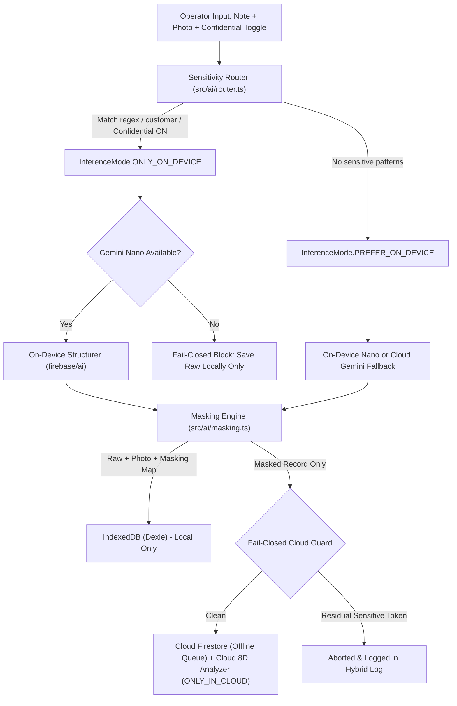

# LineNote Architecture

> **"Hybrid isn't a fallback trick here — it's a data-governance policy. The app decides per request where inference is allowed to run."**

```mermaid
flowchart TD
    A["Operator Input: Note + Photo + Confidential Toggle"] --> B["Sensitivity Router (src/ai/router.ts)"]
    B -->|"Match regex / customer / Confidential ON"| C["InferenceMode.ONLY_ON_DEVICE"]
    B -->|"No sensitive patterns"| D["InferenceMode.PREFER_ON_DEVICE"]

    C --> E{"Gemini Nano Available?"}
    E -->|"Yes"| F["On-Device Structurer (firebase/ai)"]
    E -->|"No"| G["Fail-Closed Block: Save Raw Locally Only"]

    D --> H["On-Device Nano or Cloud Gemini Fallback"]

    F --> I["Masking Engine (src/ai/masking.ts)"]
    H --> I

    I -->|"Raw + Photo + Masking Map"| J["IndexedDB (Dexie) - Local Only"]
    I -->|"Masked Record Only"| K{"Fail-Closed Cloud Guard"}
    K -->|"Clean"| L["Cloud Firestore (Offline Queue) + Cloud 8D Analyzer (ONLY_IN_CLOUD)"]
    K -->|"Residual Sensitive Token"| M["Aborted & Logged in Hybrid Log"]
```
